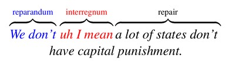
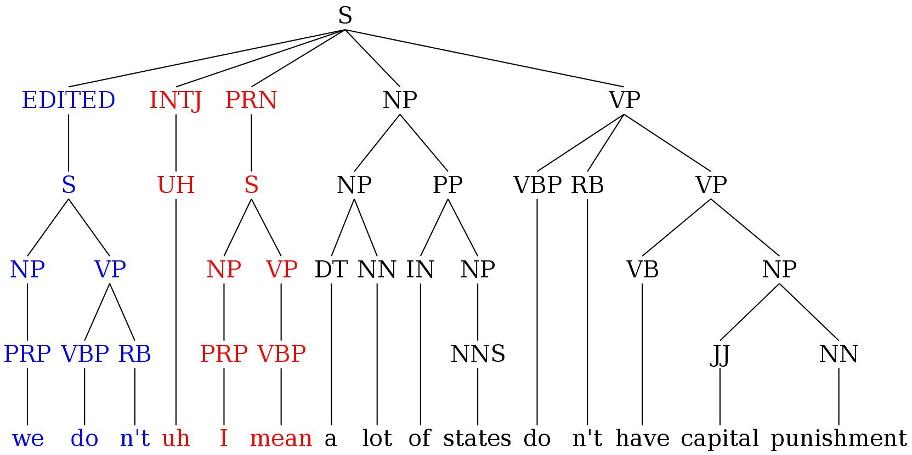

Joint Disfluency Detection and Constituency Parsing
------------------------------------------------------------
A joint disfluency detection and constituency parsing model for transcribed speech based on [Neural Constituency Parsing of Speech Transcripts](https://www.aclweb.org/anthology/N19-1282) from NAACL 2019, with additional changes (e.g. self-training and ensembling) as described in [Improving Disfluency Detection by Self-Training a Self-Attentive Model](https://www.aclweb.org/anthology/2020.acl-main.346/) from ACL 2020.

## Contents
1. [Task](#task)
2. [Requirements for Training](#requirements-for-training)
3. [Preparation](#preparation)
4. [Pretrained Models](#pretrained-models)
5. [Using the Trained Models for Parsing](#using-the-trained-models-for-parsing)
6. [Using the Trained Models for Disfluency Tagging](#using-the-trained-models-for-disfluency-tagging)
7. [Training Instructions](#training-instructions)
8. [Reproducing Experiments](#reproducing-experiments)
9. [Citation](#citation)
10. [Contact](#contact)
11. [Credits](#credits)

### Task
Disfluency refers to any interruptions in the normal flow of speech, including filled pauses (*um*, *uh*), repetitions (*they're ... they're here*), corrections (*to Sydney ... no to Melbourne*), false starts (*we would like ... let's go*), parenthetical asides (*you know*, *I mean*), partial words (*wou-*, *oper-*) and interjections (*well*, *like*). One type of disfluency which is especially problematic for conventional syntactic parsers are speech repairs. A speech repair consists of three main parts; the *reparandum*, the *interregnum* and the *repair*. As illustrated in the example below, the reparandum *we don't* is the part of the utterance that is replaced or repaired, the interregnum *uh I mean* (which consists of a filled pause *uh* and a discourse marker *I mean*) is an optional part of the disfluency, and the repair *a lot of states don't* replaces the reparandum. The fluent version is obtained by removing the reparandum and the interregnum.

<p align="center">
  
</p>

This repository includes the code used for training a joint disfluency detection and constituency parsing model of transcribed speech on the Penn Treebank-3 Switchboard corpus. Since the Switchboard trees include both syntactic constituency nodes and disfluency nodes, training a parser to predict the Switchboard trees can be regarded as multi-task learning (where the tasks are syntactic parsing and identifying disfluencies). In the Switchboard treebank corpus the *reparanda*, *filled pauses* and *discourse markers* are dominated by *EDITED*, *INTJ* and *PRN* nodes, respectively. Filled pauses and discourse markers belong to a finite set of words and phrases, so INTJ and PRN nodes are trivial to detect. Detecting EDITED nodes, however, is challenging and is the main focus of disfluency detection models.

<p align="center">
  
</p>

### Requirements for Training
* Python 3.6 or higher.
* Cython 0.25.2 or any compatible version.
* [PyTorch](http://pytorch.org/) 0.4.1, 1.0/1.1, or any compatible version.
* [EVALB](http://nlp.cs.nyu.edu/evalb/). Before starting, run `make` inside the `EVALB/` directory to compile an `evalb` executable. This will be called from Python for evaluation.
* [AllenNLP](http://allennlp.org/) 0.7.0 or any compatible version (only required when using ELMo word representations)
* [pytorch-pretrained-bert](https://github.com/huggingface/pytorch-pretrained-BERT) 0.4.0 or any compatible version (only required when using BERT word representations)

### Preparation
```bash
$ git clone https://github.com/pariajm/joint-disfluency-detector-and-parser
$ cd joint-disfluency-detector-and-parser/EVALB
$ make evalb 
$ cd .. 
```

To use ELMo embeddings, follow the additional steps given below:

```bash
$ mkdir data && cd data
$ wget https://s3-us-west-2.amazonaws.com/allennlp/models/elmo/2x4096_512_2048cnn_2xhighway/elmo_2x4096_512_2048cnn_2xhighway_options.json
$ wget https://s3-us-west-2.amazonaws.com/allennlp/models/elmo/2x4096_512_2048cnn_2xhighway/elmo_2x4096_512_2048cnn_2xhighway_weights.hdf5
$ cd ..
```
### Pretrained Models
The following pre-trained models, which have been optimized for their performance on parsing EDITED nodes i.e. F(S_E) on the SWBD dev set, are available for download:
* [`swbd_fisher_bert_Edev.0.9078.pt`](https://github.com/pariajm/joint-disfluency-detector-and-parser/releases/download/naacl2019/swbd_fisher_bert_Edev.0.9078.pt): Our best model self-trained on the Switchboard gold parse trees and Fisher silver parse trees with BERT-base-uncased word representations (EDITED word f-score=92.4%).
* [`swbd_bert_Edev.0.8922.pt`](https://github.com/pariajm/joint-disfluency-detector-and-parser/releases/download/naacl2019/swbd_bert_Edev.0.8922.pt): Our best model trained on the Switchboard gold parse trees with BERT-base-uncased word representations (EDITED word f-score=90.9%).
* [`swbd_elmo_tree_transformation_Edev.0.8838.pt`](https://github.com/pariajm/joint-disfluency-detector-and-parser/releases/download/naacl2019/swbd_elmo_tree_transformation_Edev.0.8838.pt): Our best model trained on the tree transformed Switchboard gold parse trees (as described in Section 4.4 [here](https://www.aclweb.org/anthology/N19-1282)) with ELMo word representations (EDITED word f-score=88.7%).
* [`swbd_elmo_Edev.0.872.pt`](https://github.com/pariajm/joint-disfluency-detector-and-parser/releases/download/naacl2019/swbd_elmo_Edev.0.872.pt): Our best model trained on the Switchboard gold parse trees with ELMo word representations (EDITED word f-score=87.5%).

### Using the Trained Models for Parsing 
Use the [pre-trained models](#pretrained-models) to find the constituency parse trees as well as disfluency labels for your own sentences. Before running the following commands, make sure to follow the steps in [Requirements for Training](#requirements-for-training) and [Preparation](#preparation) first. The format of the input in `best_models/raw_sentences.txt` is one sentence per line. For the best performance, remove punctuations and split clitics ("I 'm" instead of "I'm"). 

```bash
$ cd best_models
$ wget https://github.com/pariajm/joint-disfluency-detector-and-parser/releases/download/naacl2019/swbd_fisher_bert_Edev.0.9078.pt
$ cd ..
$ mkdir model && cd model
$ wget https://s3.amazonaws.com/models.huggingface.co/bert/bert-base-uncased-vocab.txt
$ wget https://s3.amazonaws.com/models.huggingface.co/bert/bert-base-uncased.tar.gz
$ tar -xf bert-base-uncased.tar.gz && cd ..
$ python3 src/main.py parse --input-path best_models/raw_sentences.txt --output-path best_models/parsed_sentences.txt --model-path-base best_models/swbd_fisher_bert_Edev.0.9078.pt >best_models/out.log
```
### Using the Trained Models for Disfluency Tagging
If you want to use the trained models to disfluency label your own data, check [here](https://github.com/pariajm/fisher-annotations).

### Training Instructions
First, obtain silver parse trees for your unlabelled data by running the commands given in [here](#using-the-trained-models-for-parsing). Then, you can train a new model on the enlarged training set (gold + silver parse trees) using the following command:
  
```bash
$ python3 src/train_parser.py --config results/swbd_fisher_bert_config.json --eval-path results/eval.txt >results/out_and_error.txt
```

### Reproducing Experiments
The code used for our NAACL 2019 paper is tagged `naacl2019` in git. The version of the code currently in this repository includes new features (e.g. BERT support and self-training).

### Citation
If you use this model, please cite the following papers:
```
@inproceedings{jamshid-lou-2019-neural,
    title = "Neural Constituency Parsing of Speech Transcripts",
    author = "Jamshid Lou, Paria and Wang, Yufei and Johnson, Mark",
    booktitle = "Proceedings of the 2019 Conference of the North {A}merican Chapter of the Association for Computational Linguistics: Human Language Technologies, Volume 1 (Long and Short Papers)",
    month = "June",
    year = "2019",
    address = "Minneapolis, Minnesota",
    publisher = "Association for Computational Linguistics",
    url = "https://www.aclweb.org/anthology/N19-1282",
    doi = "10.18653/v1/N19-1282",
    pages = "2756--2765"
}
```

```
@inproceedings{jamshid-lou-2020-improving,
    title = "Improving Disfluency Detection by Self-Training a Self-Attentive Model",
    author = "Jamshid Lou, Paria and Johnson, Mark",
    booktitle = "Proceedings of the 58th Annual Meeting of the Association for Computational Linguistics",
    month = "jul",
    year = "2020",
    address = "Online",
    publisher = "Association for Computational Linguistics",
    url = "https://www.aclweb.org/anthology/2020.acl-main.346",
    pages = "3754--3763"
}
```

### Contact
Paria Jamshid Lou <paria.jamshid-lou@hdr.mq.edu.au>

 
### Credits
The code for self-attentive parser and most parts of the README file are based on https://github.com/nikitakit/self-attentive-parser.


